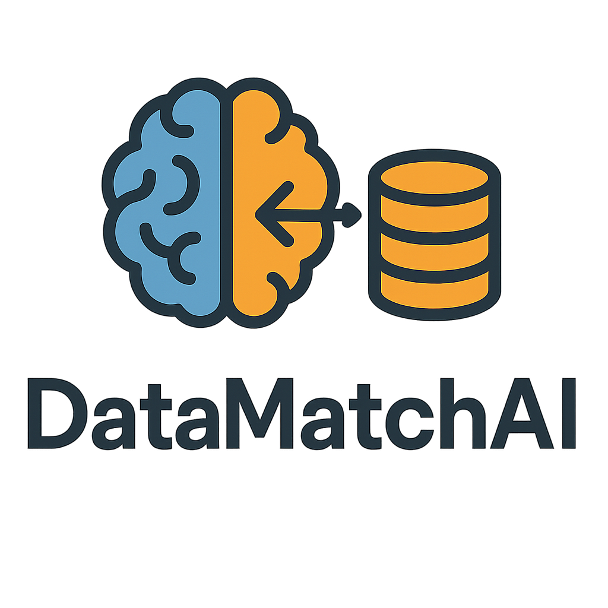

# 🔍 DataMatchAI: Dataset Suitability Checker


DataMatchAI helps researchers and data scientists quickly find public datasets relevant to their research goals. Just describe your project idea, and this tool uses a language model to match you with appropriate datasets and explain why.

---

## 🚀 Features
- 🔎 Natural language input (e.g., "detecting depression from social media posts")
- 🤖 AI-powered dataset matching using Hugging Face Inference API
- 📊 Streamlit interface for visual feedback and results
- 📥 CSV download of suggestions
- 🕘 Search history for re-analysis

---

## 🧰 Tech Stack
- **Frontend/UI**: Streamlit
- **LLM Backend**: Hugging Face API (e.g., `mistralai/Mistral-7B-Instruct-v0.2`)
- **Language**: Python

---

## 📦 Installation

```bash
# Clone the repo
git clone https://github.com/jshimpi02/DataMatchAI.git
cd DataMatchAI

# Create virtual environment (optional but recommended)
python -m venv venv
source venv/bin/activate  # or .\venv\Scripts\activate on Windows

# Install dependencies
pip install -r requirements.txt

# Set up your Hugging Face API token
cp .env.example .env
# Then edit the .env file with your actual Hugging Face token
```

---

## 🧪 Run the App
```bash
streamlit run app.py
```
Then open `http://localhost:8501` in your browser.

---

## ☁️ Streamlit Cloud Deployment
1. Push your code to GitHub
2. Go to [streamlit.io/cloud](https://streamlit.io/cloud)
3. Link your repo and add `HUGGINGFACE_API_TOKEN` as a **secret**

---

## 📁 File Structure
```
DataMatchAI/
├── app.py                  # Main Streamlit UI
├── generator.py            # Hugging Face query logic
├── .env.example            # Template for API key
├── requirements.txt        # Dependencies
├── README.md               # You're reading it
└── assets/
    └── icon.png            # App logo
```

---

## 🧠 Example Prompts
- "Classifying tumors from histopathology images"
- "Analyzing stress levels via voice data"
- "Traffic pattern analysis in smart cities"

---

## 📜 License
MIT License. Free for personal and academic use.

---

## ✨ Project Icon


---

Enjoy exploring datasets with DataMatchAI!

